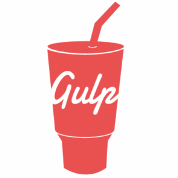
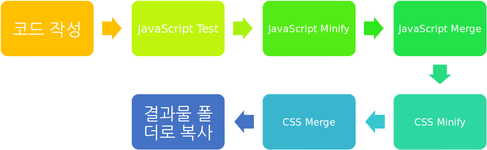
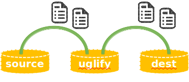
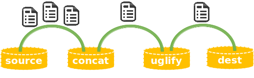

class: center, middle

# .bold.red[Gulp] 시작하기



---

## **.red[Gulp] 개념**
***
### ▶ Node.js 기반의 Task runner
- http://gulpjs.com/
- 반복적인 작업이나 프론트엔드 빌드에 필요한 작업을 쉽게 처리할 수 있다.

.center[

]

---

## **.red[Gulp] 개념**
***
### ▶ Stream 기반의 Build System
- Event-driven, Non-blocking I/O 특성을 살려 요청 후 한번에 결과를 받는 것이 아니라 이벤트로 중간 중간 전달 받는 Stream 방식으로 동작
- Gulp의 task는 파이프로 연결되고, 작업 대상 파일들이 파이프를 따라 흘러가며 병렬로 동시에 여러 task가 수행


.center[

]
 
 
---
## **.red[Gulp] 설치하기**
***
### ▶ Node.js와 npm 설치 후 
- package.json 생성
```
$ npm init
```

- gulp 설치 
```
$ npm install gulp --g              // global 설치
　
$ npm install gulp --save-dev       // local 설치
``` 
- gulpfile.js 생성

---
## **Step 1. Hello Gulp**
***

- 'Hello Gulp!'를 콘솔에 출력하는 task
```
var gulp = require('gulp');
　
gulp.task('hello', function () {
        console.log('Hello Gulp!');
});
```

--

- Default task 설정
```
gulp.task('default', ['hello']);
```

---
## **Step 2. Series Tasks**
***

- task 간의 dependency 설정
- 순차적으로 Task 실행하기
```
var gulp = require('gulp');
　
gulp.task('hello', function () {
        return console.log('Hello');
});
　
gulp.task('world', ['hello'], function () {
        return console.log('World!');
});
　
gulp.task('default', ['world']);
```

---
## **Step 3. Javascript Minify and Uglify**
***

- Javascript 파일을 코드를 줄이고 난독화 하는 작업
- Javascript 엔진이 보다 빠르게 해석되도록 함
```
$ npm install gulp-uglify --save-dev
```
```
var gulp = require('gulp');
var uglify = require('gulp-uglify');
　
gulp.task('uglify', function () {
        return gulp.src('src/*.js')
            .pipe(uglify())
            .pipe(gulp.dest('dist'));
});
　
gulp.task('default', ['uglify']);
```

---
## **Step 3. Javascript Minify and Uglify**
***
### ▶ gulp.src
- task의 대상이 되는 파일들을 지정
- node-glob 문법 (https://github.com/isaacs/node-glob)
```
//src 하위의 모든 디렉토리의 js 확장자를 가진 파일
'src/**/*.js'
//foo 디렉토리와 bar 디렉토리에서 js 확장자를 가진 파일
['foo/*.js', 'bar/*.js']
```

### ▶ gulp.dest
- task의 결과물이 저장될 경로를 지정

### ▶ pipe
- 대상으로 지정된 각 파일들을 stream 형태로 읽어들여서 다음으로 거쳐야할 플러그인 등으로 연결

.center[

]

---
## **Step 4. Watch**
***
### ▶ gulp.watch
- js, css 등 코드에 변경이 있을 때마다 변경을 감지해서 task 를 실행할 수 있는 기능을 제공
- 첫번째 매개변수는 변경을 감지해야되는 대상 지정
- 두번째 매개변수는 변경이 감지되면 실행될 task 지정(배열 형태)
```
var gulp = require('gulp');
var uglify = require('gulp-uglify');
　
gulp.task('uglify', function () {
        return gulp.src('src/*.js') 
            .pipe(uglify()) 
            .pipe(gulp.dest('dist')); 
});
　
gulp.task('watch', function () {
    *   gulp.watch('src/*.js', ['uglify']);
});
　
gulp.task('default', ['uglify', 'watch']);
```

---
## **Step 5. 파일 병합**
***

- 일반적으로 운영환경에서는 Minify된 파일들을 병합해서 하나의 파일로 만들어서 배포
```
$ npm install gulp-concat --save-dev
```
```
var gulp = require('gulp');
var uglify = require('gulp-uglify');
var concat = require('gulp-concat');
　
gulp.task('uglify', function () {
        return gulp.src('src/*.js') 
    *       .pipe(concat('main.js')) 
            .pipe(uglify()) 
            .pipe(gulp.dest('dist'));
});
　
gulp.task('watch', function () {
       gulp.watch('src/*.js', ['uglify']);
});
　
gulp.task('default', ['uglify', 'watch']);
```

---
## **Step 5. 파일 병합**
***

- src 메서드로 가져온 파일들을 파이프로 연결해서 concat 플러그인으로 던지는 부분을 추가
.center[

]

---
## **Step 6. CSS Minify**
***

- CSS 파일도 운영환경을 위해 Minify해서 배포
- 포함되어 있는 @import를 분석해서 하나의 파일로 병합
```
$ npm install gulp-minify-css --save-dev
```
```
var gulp = require('gulp');
var concat = require('gulp-minify-css');
　
gulp.task('minifycss', function () {
        return gulp.src('src/css/main.css')
            .pipe(minifycss())
            .pipe(gulp.dest('dist/css'));
});
　
gulp.task('watch', function () {
        gulp.watch('src/**/*.css', ['minifycss']);
});
　
gulp.task('default', ['minifycss', 'watch']);
```

---
## **Step 7. BrowserSync로 서버 실행하기**
***

- http://www.browsersync.io/
- 테스트하기 위해 브라우저 자동 실행 및 변경된 파일을 자동 업데이트
```
$ npm install browser-sync --save-dev
```
```
var browserSync = require('browser-sync').create();
　
gulp.task('server', ['uglify', 'minifycss', 'minifyhtml'], function () {
        return browserSync.init({
            server: {
                baseDir: './dist'
            }
        });
});
　
gulp.task('uglify', function () {
        return gulp.src('src/**/*.js')
            .pipe(concat('main.js'))
            .pipe(uglify())
            .pipe(gulp.dest('dist/js'))
    *       .pipe(browserSync.reload({stream:true}));
});
```

---
## **Step 8. Browserify로 모듈 번들링**
***
### ▶ 자바스크립트 번들링
- ES6에 제공되는 모듈 정의 방법으로 사용된 소스를 ES5.1로 변환 
- 메인 자바스크립트 파일에서 사용되고 있는 모듈을 찾아 하나의 파일로 생성 
```
npm install browserify vinyl-source-stream vinyl-buffer --save-dev 
```
```
var browserify = require('browserify');
var source = require('vinyl-source-stream');
var buffer = require('vinyl-buffer');
　
gulp.task('uglify', function () {
        return browserify('src/js/main.js')
            .bundle() 
            .pipe(source('main.js'))
            .pipe(buffer())
            .pipe(uglify())
            .pipe(gulp.dest('dist/js'))
            .pipe(browserSync.reload({stream:true}));
});
```

---
## **Step 8. Browserify로 모듈 번들링**
***
### ▶ Vinyl Object
- Gulp는 경로와 컨텐츠 등의 메타데이터로 이루어진 일종의 가상 파일 포맷인 Vinyl Object 기반의 Stream을 사용한다. 
- browserify의 번들링 결과는 예외적으로 Readalbe stream이 생성되므로 Vinyl Object로 변환이 필요하다.
- gulp-uglify 플러그인은 특수하게 Buffered vinyl object 받아 동작하기 때문에 변환이 이 또한 변환이 필요하다.


---
## **참고**
***

[1] [Gulp에 대한 소개](http://programmingsummaries.tistory.com/356)

---
class: middle, center

# 끝